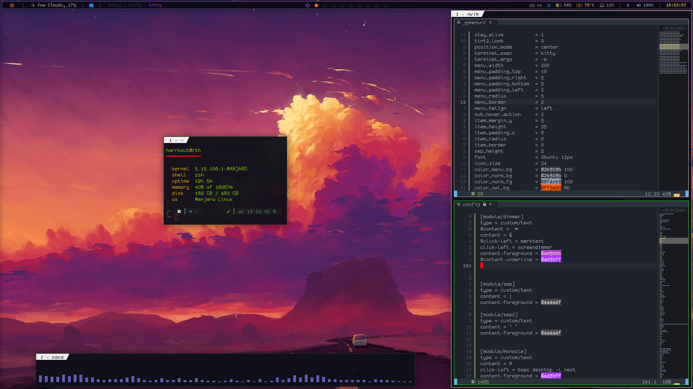

## dotfiles

2023 (updated) rice

1. Bspwm
2. Polybar
3. Sxhkd 

Updated on 05/04/21 

> Polybar

>Stop losing the damn configs! (pls stop)

### Polybar changes

1.  Added application modules (launchers)
  > colored icons with foreground and underline

2. Modules added:
  - [x] App menu (rofi theme launcher)
  - [x] Monocle/Tiled layout alteration
  - [x] firefox
  - [x] kitty
  - [x] thunar
  - [x] Mailspring

3. Icons on volumebar and xbacklight (along with gradient underline and colored muted label with visible (muted) volume percentage indicator
4. Fan module (just so to know when to expect a helicopter sound blast
5. Popup Calendar (yad application made floating via bspwmrc)

# Changes to come
- [X] tlp config for T440p ( went from 13w to 8.9w -- yay)
- [] rofi command and theme
- [X] maybe try pywall? (think I did it for now)
- [ ] kitty config (and kitty-cat)

# To copy neovim configuration
- Install neovim
- copy files to ~/.config/nvim
- run nvim from temrinal
- :PlugInstall
- :PlugUpdate
- You're ready to go
